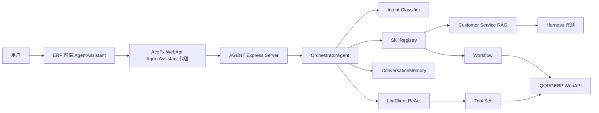

# QQPGERP Agent 技术架构实现

## 1. 文档目标

本文档说明 `interview/AGENT` 子项目的实际技术架构、核心调用链、模块职责、ERP 对接方式、AI 客服 RAG、意图识别、人工授权机制、短期记忆和评测 harness。

适用场景：

- 本地开发与联调
- 新增业务 Tool / Skill / Workflow
- 排查 Agent 与 ERP、LLM、前端 AI 助手的链路问题
- 作为后续上线治理、审批落库和可观测性建设的基础说明

---

## 2. 系统定位

`QQPGERP Agent` 是运行在 Node.js 上的 ERP 智能业务编排服务。它不是 ERP 业务逻辑的替代层，而是面向自然语言、客服问答和业务事件的智能调度入口。

当前系统支持四类核心能力：

- `AI 客服问答`
  基于客服话术 docx 构建 FAQ RAG，自动回答服务费、采购款、收益提现、跨境店、协议条款、APP 操作等问题。
- `ERP 业务意图识别`
  将用户输入路由到客服 FAQ、履约流程、库存预警、订单处理或未知兜底。
- `LLM + Tools`
  对开放式 ERP 请求使用 Function Calling + ReAct 循环，由模型选择工具并基于工具结果继续推理。
- `Skill / Workflow`
  对强约束业务链路使用代码工作流，例如履约流程和客服 FAQ，降低模型自由发挥风险。

核心业务链包括：

```text
客服问题 -> 意图识别 -> customer_service_faq Skill -> RAG 检索 -> 中文话术回复

库存问题 -> query_inventory -> high_risk / ordinary 预警 -> trigger_purchase -> 创建采购需求单 -> 请求人工授权

人工授权 -> 一审 -> 二审 -> 根据需求单生成采购单

履约请求 -> fulfillment_flow Skill -> 库存分配 -> 缺货补货 -> 供应商协同
```

---

## 3. 技术栈

### 3.1 服务端

- TypeScript
- Node.js
- Express
- ts-node-dev
- pnpm

### 3.2 AI 与调度

- OpenAI SDK
- OpenAI Function Calling 兼容模式
- ReAct 多轮工具调用
- LlamaIndex.TS
- 本地 Hash Embedding

### 3.3 文档解析与 RAG

- mammoth
- LlamaIndex `Document`
- LlamaIndex `VectorStoreIndex`
- LlamaIndex `storageContextFromDefaults`
- FAQ 结构化解析
- 关键词 rerank

### 3.4 集成与基础设施

- Axios
- Pino / pino-pretty
- dotenv
- uuid
- Jest / ts-jest

### 3.5 前端与 ERP 集成

- Vue3
- Pinia
- Ant Design Vue
- SSE
- .NET WebAPI AgentAssistant 代理
- QQPGERP ERP WebAPI

---

## 4. 总体架构



### 4.1 设计原则

- HTTP 层只负责路由、入参校验和 SSE 输出。
- Orchestrator 统一承担意图识别、Skill 路由和 LLM Tool Loop。
- 明确业务规则优先走 Skill / Workflow，不依赖 LLM 自由判断。
- 原子 ERP 能力通过 Tool 暴露给 LLM。
- ERP 访问统一走 API Client 适配层。
- 高风险动作不让 AI 直接闭环，必须通过人工授权。
- 工具调用和授权请求通过 `steps` 与 SSE 事件展示，便于排查。
- 短期记忆只保留必要上下文，避免无限膨胀。

---

## 5. 目录与模块分层

### 5.1 启动层

文件：

- `src/index.ts`
- `src/config.ts`
- `src/logger.ts`

职责：

- 加载环境变量
- 初始化 Agent Tools
- 初始化 Skills
- 启动 Express HTTP 服务
- 输出服务启动日志

### 5.2 HTTP 接口层

文件：

- `src/server.ts`

职责：

- 注册 `/api/agent/*` 普通 JSON 接口
- 注册 `/api/AgentAssistant/StreamMessage` SSE 接口
- 将 `AgentResult.steps` 转成工具调用事件
- 从工具结果中提取 `approvalRequest` 并输出 `approval.requested`
- 提供 memory、skills、fulfillment、customer-service 等管理入口

### 5.3 调度层

文件：

- `src/core/orchestrator.ts`
- `src/core/llm-client.ts`

职责：

- 接收自然语言和结构化上下文
- 调用 `classifyIntent` 产生意图 metadata
- 优先匹配运行时 Skill
- 未命中 Skill 时走 LLM + Tools ReAct 循环
- 写入步骤记录
- 在指定 `sessionId` 时接入短期记忆

### 5.4 意图识别层

文件：

- `src/customer-service/intent-classifier.ts`

当前意图：

- `customer_service_faq`
- `fulfillment_flow`
- `stock_alert`
- `order_process`
- `unknown`

设计策略：

- context 显式指定优先级最高。
- SKU + 发货/采购/供应商关键词优先判定为履约。
- 库存预警、安全库存、缺口数量优先判定为库存预警。
- 客服话术关键词命中后判定为客服 FAQ。
- 未命中时返回 `unknown`，避免强行编排业务动作。

### 5.5 Skill 层

文件：

- `src/core/skill-registry.ts`
- `src/skills/index.ts`
- `src/skills/fulfillment-skill.ts`
- `src/skills/customer-service-skill.ts`

当前 Skill：

- `fulfillment_flow`
- `customer_service_faq`

职责：

- 注册和管理业务 Skill
- 基于触发规则匹配用户请求
- 将自然语言或上下文转成固定 workflow / RAG 输入
- 返回结构化 metadata，供前端展示和 harness 评测

### 5.6 RAG 与客服知识库层

文件：

- `src/customer-service/faq-parser.ts`
- `src/customer-service/rag-service.ts`
- `src/customer-service/hash-embedding.ts`

职责：

- 使用 mammoth 解析 `百问百答7.20（新）.docx`
- 抽取 FAQ 条目，保留 `id`、`category`、`question`、`answer`、`sourceDoc`、`sourceSection`
- 使用 LlamaIndex.TS 构建 `VectorStoreIndex`
- 使用本地 Hash Embedding 保证开发环境可运行
- 对检索结果做关键词 rerank
- 低置信时返回转人工，不编造政策

### 5.7 Tool 层

文件：

- `src/tools/agent-tools.ts`

当前注册工具：

- `query_inventory`
- `coordinate_logistics`
- `trigger_purchase`
- `notify_supplier`
- `execute_fulfillment_flow`

设计特点：

- Tool 是 LLM 可见的原子能力。
- Tool 内部仍调用确定性代码和 ERP API。
- `trigger_purchase` 在成功创建采购需求单后返回 `approvalRequest`。
- `execute_fulfillment_flow` 将固定 workflow 也暴露为工具，方便 LLM 调度。

### 5.8 Workflow 层

文件：

- `src/core/fulfillment-workflow.ts`

职责：

- 按固定顺序执行履约流程
- 先查询库存并分配仓库
- 缺货时触发采购
- 采购后协同供应商
- 汇总结构化 `lines` 和中文 `summary`

### 5.9 ERP 适配层

文件：

- `src/api/erp-client.ts`
- `src/api/inventory-api.ts`
- `src/api/purchase-api.ts`
- `src/api/supplier-api.ts`
- `src/api/logistics-api.ts`

职责：

- 统一封装 ERP HTTP 调用
- 注入 `X-Agent-Api-Key`
- 统一请求日志、超时和异常处理
- 兼容 ERP `code === 0` 和 `success === true`
- 适配 ERP PascalCase DTO 到 Agent 内部模型

### 5.10 专业 Agent 层

文件：

- `src/agents/inventory-agent.ts`
- `src/agents/purchase-agent.ts`
- `src/agents/supplier-agent.ts`
- `src/agents/logistics-agent.ts`

职责：

- 封装具体业务域能力
- 对外既能作为 Tool 能力使用，也能被 Workflow 直接调用

### 5.11 短期记忆层

文件：

- `src/core/conversation-memory.ts`

职责：

- 按 `sessionId` 保存最近多轮成功问答
- 支持超过阈值后压缩或裁剪
- 支持 TTL 过期清理
- 支持查询和清空

---

## 6. 核心运行链路

### 6.1 启动链路

```text
index.ts
  -> initializeAgents()
  -> initializeSkills()
  -> createApp()
  -> app.listen(PORT)
```

### 6.2 普通对话链路

```text
POST /api/agent/chat
  -> server.ts
  -> orchestrator.chat(message, context, sessionId)
  -> classifyIntent()
  -> SkillRegistry.findMatch()
     -> 命中 Skill: 执行 Skill
     -> 未命中 Skill: 组装 system prompt + memory + user message
                   -> LlmClient.runReActLoop()
                   -> 调用 Tool
                   -> 结果回填
                   -> 得到最终回复
  -> 返回 AgentResult
```

### 6.3 前端 AI 助手流式链路

```text
ERP 前端 AgentAssistantDrawer
  -> POST /api/AgentAssistant/StreamMessage
  -> AceFx.WebApi AgentAssistantController
  -> AgentAssistantStreamService 转发到 AGENT
  -> AGENT /api/AgentAssistant/StreamMessage
  -> orchestrator.chat()
  -> SSE 输出:
     conversation.created
     message.delta
     tool.completed / tool.failed
     approval.requested
     message.completed
```

### 6.4 客服问答链路

```text
用户咨询客服政策
  -> classifyIntent: customer_service_faq
  -> SkillRegistry 命中 customer_service_faq
  -> customerServiceRag.retrieve()
  -> LlamaIndex VectorStoreIndex 检索
  -> 关键词 rerank
  -> 命中则返回标准话术
  -> 低置信则返回转人工
```

### 6.5 库存预警到采购授权链路

```text
用户问 SKU 是否需要补货
  -> query_inventory
  -> alertLevel = high_risk / ordinary 或 procurementRequired = true
  -> trigger_purchase
  -> purchaseApi.createPurchaseApply()
  -> ERP /api/PurchaseApply/AddAndGetDetail
  -> 返回 applyId / applyNumber / applySkuId
  -> buildPurchaseApprovalRequest()
  -> SSE approval.requested
  -> 前端授权卡片
  -> 用户点击授权执行
  -> FirstAuditApply
  -> SecondAuditApply
  -> GenPurchaseOrderFromApply
```

---

## 7. Orchestrator 设计

### 7.1 职责

- 统一自然语言入口
- 统一意图识别 metadata 输出
- Skill 优先路由
- LLM Tool Loop 回退
- session 级短期记忆接入
- `steps` 结构化记录

### 7.2 路由优先级

1. context 显式指定 Skill 或触发类型
2. SkillRegistry 匹配业务 Skill
3. Skill 未命中时进入 LLM + Tool 模式
4. LLM 根据工具定义选择 Tool
5. Tool 结果回填后继续推理或生成最终答案

这种策略保证：

- 客服问题不会误入采购流程
- 履约请求不会被客服 RAG 抢走
- 强业务链优先走代码工作流
- 开放式问题仍可利用 LLM 工具组合能力

---

## 8. LLM ReAct 执行架构

文件：

- `src/core/llm-client.ts`

执行步骤：

1. 将内部 `ToolDef` 转为 OpenAI Tools Schema。
2. 发送 system prompt、短期记忆、用户消息和工具列表。
3. LLM 返回普通文本或 `tool_calls`。
4. 如果返回 `tool_calls`，并行执行对应工具。
5. 将工具结果作为 `tool` 消息追加回 history。
6. 继续下一轮，直到模型不再调用工具或达到 `MAX_AGENT_STEPS`。

特点：

- 支持 OpenAI 兼容服务。
- 支持同一轮多个工具调用并行执行。
- 每次工具调用会形成 `AgentStep`，用于审计和前端展示。
- 工具失败不会直接导致服务崩溃，会以错误结果进入 step。

---

## 9. 人工授权机制

### 9.1 为什么需要授权

一审、二审、生成采购单属于高风险 ERP 操作，会产生真实单据并影响采购、供应商、库存和财务。因此 Agent 不能直接绕过当前登录用户和 ERP 权限体系执行。

当前策略：

- AI 可以查询库存。
- AI 可以推荐供应商。
- AI 可以创建待审核采购需求单。
- AI 不能直接一审、二审和生成采购单。
- 一审、二审和生成采购单必须由前端当前登录用户点击授权后执行。

### 9.2 授权请求结构

`trigger_purchase` 创建需求单成功后返回：

```json
{
  "approvalId": "purchase-apply-123-456",
  "kind": "purchase_apply_full_approval",
  "applyId": 123,
  "applyNumber": "CGXQ202604170007",
  "applySkuId": 456,
  "skuCode": "WGXB02000201",
  "qty": 2,
  "supplierId": 11,
  "supplierName": "ces11",
  "estimatedArrivalDate": "2026-04-21",
  "actions": [
    "first_audit",
    "second_audit",
    "gen_purchase_order"
  ]
}
```

### 9.3 软打断 ReAct

当前实现不是在 ReAct loop 内部挂起等待用户输入，而是使用软打断：

```text
ReAct 正常执行工具
  -> 工具结果包含 approvalRequest
  -> server.ts 提取 approvalRequest
  -> SSE 输出 approval.requested
  -> 前端插入授权卡片
```

优点：

- 不需要让 LLM 保持等待状态。
- 不依赖模型记忆审批上下文。
- 授权动作由前端和 ERP 接口确定性执行。
- 权限、登录态和审计仍由 ERP 控制。

### 9.4 授权执行

前端收到 `approval.requested` 后创建 `approval` 类型消息，渲染采购授权卡片。

用户点击“授权执行”后，前端按固定顺序调用：

```text
getApplyDetail()
firstAuditApply()
secondAuditApply()
genPurchaseOrderFromApply()
```

这些接口仍然经过 ERP WebAPI 的 `[LoginRequired]` 和 `[Permission]` 校验。

---

## 10. 前端 AgentAssistant 集成

前端路径：

- `qqpgerp-front/src/qqpgerp/src/layouts/default/feature/agent-assistant/AgentAssistantDrawer.vue`
- `qqpgerp-front/src/qqpgerp/src/store/modules/agentAssistant.ts`
- `qqpgerp-front/src/qqpgerp/src/api/AgentAssistant/index.ts`

能力：

- SSE 流式接收 AI 回复
- 展示用户消息和 AI 消息
- 展示工具调用卡片
- 默认折叠工具输入摘要和结果摘要
- 展示采购授权卡片
- 支持消息复制、重新生成、点赞、踩
- 回车发送消息，发送后清空输入框
- 携带当前页面上下文和当前用户上下文

---

## 11. ERP WebAPI AgentAssistant 代理

后端路径：

- `qqpgerp-webapi/src/AceFx.WebApi/Controllers/AgentAssistantController.cs`
- `qqpgerp-webapi/src/AceFx.WebApi/AgentAssistant/AgentAssistantStreamService.cs`
- `qqpgerp-webapi/src/AceFx.WebApi/configs/agent_assistant.json`

职责：

- 提供 ERP 前端统一访问入口。
- 读取当前登录用户、角色、权限码和页面上下文。
- 将请求转发给 `interview/AGENT` 服务。
- 将下游 SSE 事件转发给前端。

注意：

- 开发环境可以让前端直连 `http://localhost:3101/api/AgentAssistant/StreamMessage`。
- 如果生产环境走 WebAPI 代理，需要确保代理白名单包含 `approval.requested`，否则授权事件会被过滤。

---

## 12. Purchase 领域实现

文件：

- `src/api/purchase-api.ts`
- `src/agents/purchase-agent.ts`
- `src/tools/agent-tools.ts`

当前逻辑：

- 根据 SKU 查找真实商品资料。
- 获取供应商候选。
- 根据缺口数量计算采购建议量。
- 根据紧急程度、默认供应商、评分、价格等选择供应商。
- 调用 ERP `api/PurchaseApply/AddAndGetDetail` 创建需求单并返回详情。
- 从 ERP 返回详情中提取 `applyId`、`applyNumber`、`applySkuId`、供应商、价格、仓库和到货日期。
- 构造 `approvalRequest`，交给前端做人工授权。

---

## 13. Inventory 领域实现

文件：

- `src/api/inventory-api.ts`

库存查询能力：

- 支持 SKU 查询。
- 支持商品名称查询。
- 对 WGXB02000201、KC10737483 等字母数字编码优先按 SKU 处理。
- 返回库存数量、仓库、预警级别、是否需要采购、缺口数量等结构化字段。
- 当 `alertLevel` 为 `high_risk` 或 `ordinary` 时，Orchestrator 要继续触发采购补货。

---

## 14. Customer Service RAG 实现

文件：

- `src/customer-service/faq-parser.ts`
- `src/customer-service/rag-service.ts`
- `src/skills/customer-service-skill.ts`

流程：

```text
docx
  -> mammoth 提取文本
  -> FAQ parser 解析分类 / 问题 / 答案
  -> LlamaIndex Document
  -> VectorStoreIndex
  -> Retriever TopK
  -> 业务关键词 rerank
  -> 命中返回原始话术
  -> 低置信转人工
```

配置项：

- `CUSTOMER_SERVICE_DOCX_PATH`
- `RAG_TOP_K`
- `RAG_MIN_SCORE`
- `RAG_EMBEDDING_MODEL`
- `RAG_STORAGE_DIR`

---

## 15. 短期记忆设计

文件：

- `src/core/conversation-memory.ts`

当前设计：

- 以内存保存 session 对话。
- 默认保留至少 5 轮上下文。
- 超过阈值时进行压缩或裁剪。
- 超过 TTL 后自动失效。
- 仅保存必要 user / assistant 消息，不保存无限长工具原始数据。

相关接口：

- `GET /api/agent/memory/:sessionId`
- `DELETE /api/agent/memory/:sessionId`

边界：

- 当前不是持久化记忆。
- 服务重启后会丢失。
- 后续可演进到 Redis / 数据库 / 向量记忆。

---

## 16. Harness 评测

目录：

- `harness/`
- `scripts/customer-service-harness.ts`

命令：

```bash
pnpm run harness:customer-service
```

评测指标：

- `intent_accuracy`
- `retrieval_hit_rate@3`
- `answer_keyword_pass_rate`
- `unknown_rejection_rate`

用途：

- 验证客服 FAQ 检索是否命中正确分类。
- 验证意图识别是否把客服问题和 ERP 操作区分开。
- 验证未知问题是否拒答并转人工。
- 防止后续新增关键词或 Skill 时造成误路由。

---

## 17. HTTP 接口清单

### 17.1 AGENT 服务接口

- `GET /health`
- `POST /api/agent/chat`
- `POST /api/agent/customer-service/chat`
- `GET /api/agent/memory/:sessionId`
- `DELETE /api/agent/memory/:sessionId`
- `GET /api/agent/skills`
- `POST /api/agent/skills/:skillName/execute`
- `POST /api/agent/order/:orderId/process`
- `POST /api/agent/stock-alert`
- `POST /api/agent/fulfillment`
- `POST /api/AgentAssistant/StreamMessage`

### 17.2 ERP 前端链路接口

- `POST /api/AgentAssistant/StreamMessage`

该接口用于 ERP 前端 AI 助手的流式对话。

---

## 18. 配置设计

文件：

- `src/config.ts`
- `.env.example`

关键配置：

- `PORT`
- `LOG_LEVEL`
- `OPENAI_API_KEY`
- `LLM_MODEL`
- `LLM_BASE_URL`
- `ERP_API_BASE_URL`
- `ERP_API_TOKEN`
- `MAX_AGENT_STEPS`
- `TOOL_TIMEOUT_MS`
- `MEMORY_MAX_MESSAGES`
- `MEMORY_TTL_MS`
- `CUSTOMER_SERVICE_DOCX_PATH`
- `RAG_TOP_K`
- `RAG_MIN_SCORE`
- `RAG_EMBEDDING_MODEL`
- `RAG_STORAGE_DIR`

---

## 19. 数据模型与审计

核心模型：

- `ToolDef`
- `SkillDef`
- `AgentResult`
- `AgentStep`
- `InventoryInfo`
- `PurchaseApply`
- `SupplierCandidate`
- `FulfillmentLineInput`
- `FulfillmentLineResult`
- `CustomerServiceRetrievalHit`
- `CustomerServiceAnswer`

`AgentResult.steps` 记录：

- Tool / Skill 名称
- 输入参数
- 输出结果
- 错误信息
- 时间戳

前端工具调用卡片直接基于这些步骤展示输入摘要、结果摘要和错误信息。

---

## 20. 当前版本优点

- 同时支持客服 RAG 和 ERP 业务编排。
- 意图识别保护了客服、库存、履约、采购等不同链路的边界。
- ReAct 工具调用可审计，前端可展示工具调用过程。
- 高风险采购动作采用人工授权，不绕过 ERP 权限。
- 前端 AI 助手体验完整，支持流式消息、工具卡片、授权卡片和消息操作。
- 通过 harness 评测降低客服问答和意图识别回归风险。
- 使用 pnpm 和 ts-node-dev 支持本地热更新开发。

---

## 21. 当前边界与演进方向

### 21.1 当前边界

- 人工授权是软打断，不是持久化审批任务。
- 授权卡片刷新后的恢复能力依赖前端本地状态。
- 短期记忆仍是内存级，不适合生产长期保存。
- LlamaIndex 当前使用本地 Hash Embedding，生产可替换为正式 embedding 服务。
- 采购后续一审、二审、生成采购单由前端执行，Agent 不会自动恢复工作流继续总结。

### 21.2 演进方向

- 建立审批任务表，将 `approvalRequest` 落库。
- 支持审批超时、撤销、多人审批和审批前修改数量。
- 授权成功后回调 Agent，恢复 workflow 并生成最终总结。
- 将短期记忆迁移到 Redis 或数据库。
- 增加 Agent steps 落库和链路追踪。
- 为更多 ERP 模块补 Skill，例如供应商催货、订单异常处理、采购到货跟进。

---

## 22. 结论

当前 `QQPGERP Agent` 已从单纯的 LLM 工具调用原型，演进为具备意图识别、AI 客服 RAG、短期记忆、ReAct 工具调用、固定 Workflow、前端流式交互和人工授权机制的 ERP 智能业务编排系统。

核心设计原则是：

```text
AI 负责理解、查询、建议和准备；
代码负责确定性业务流程；
用户负责授权高风险动作；
ERP 负责权限校验、审计和最终落库。
```

